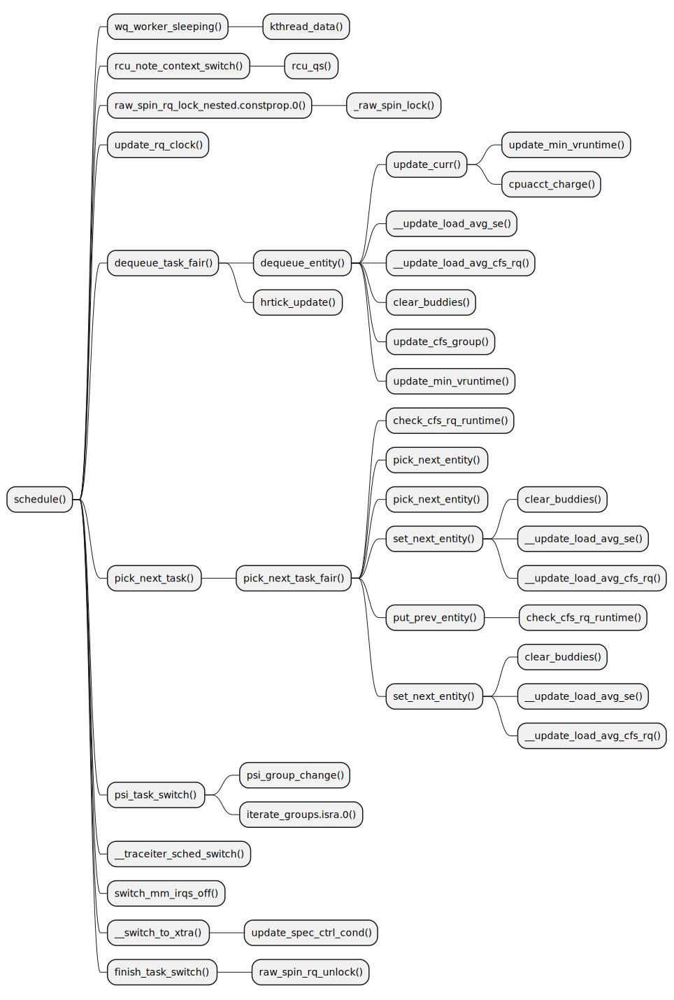
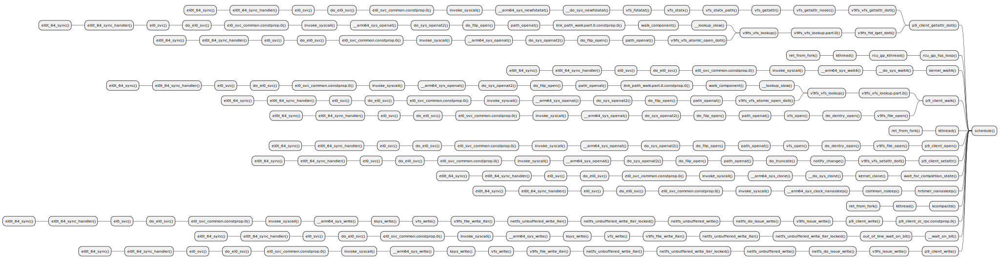

ftrace-chart
==========================
Generate plantuml chart for function-graph trace

## Usage

```
$ ./ftrace-chart.sh -h

ftrace-chart
==========================
Generate plantuml chart for function-graph trace

Format:
  ./ftrace-chart.sh [record|report] [options]

Options
  -h, --help                  Help
  -m, --mode=[trace|stack]    "trace" is function-graph chart (excution flow of the function)
                              "stack" is stacktrace chart (where has the function been called)
  -f, --function              Function to track
  -t, --timeout               Seconds to trace, you can stop mannully without passing this param.
  -o, --outdir                Directory to save trace data and chart files.

Trace Mode Example
---------------------
  Generate chart of schedule() excution flow:

  1. Record function-graph trace of schedule()
  $ ./ftrace-chart.sh record --mode=trace --function=schedule --timeout=10

  2. Generate plantuml(.puml) files of the trace
  $ ./ftrace-chart.sh report --mode=trace ./ftrace-chart.data/trace.txt

  3. Generate plantuml svg image
  $ java -jar plantuml-mit.jar -tsvg ./ftrace-chart.data/schedule~0.puml

Stack Mode Example
---------------------
  Generate chart of schedule() called positions:

  1. Record stacktrace of schedule()
  $ ./ftrace-chart.sh record --mode=stack --function=schedule --timeout=10

  2. Generate plantuml(.puml) files of the trace
  $ ./ftrace-chart.sh report --mode=stack ./ftrace-chart.data/trace.txt

  3. Generate plantuml svg image
  $ java -jar plantuml-mit.jar -tsvg ./ftrace-chart.data/schedule.puml

```

## Screen Shot

### Trace Mode
Chart of schedule() excution flow



### Stack Mode
Chart of schedule() called position


