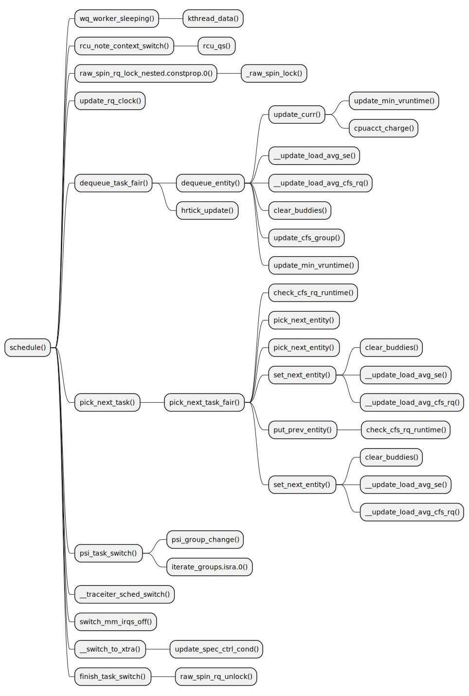

ftrace-chart
==========================
Generate plantuml chart for function-graph trace

```
$ ./ftrace-chart.sh -h

Format:
  ./ftrace-chart.sh [record|report] [options]

Options
  -h, --help                  Help
  -m, --mode=[trace|stack]    "trace" is function-graph chart (excution flow of the function)
                              "stack" is stacktrace chart (where has the function been called)
  -f, --function              Function to track
  -t, --timeout               Seconds to trace, you can stop mannully without passing this param.
  -o, --outdir                Directory to save trace data and chart files.

Examples:
  1. Record function-graph trace of schedule()
  $ ./ftrace-chart.sh record --mode=trace --function=schedule --timeout=10

  2. Generate plantuml(.puml) files of the trace
  $ ./ftrace-chart.sh report ./ftrace-chart.data/trace.txt

  3. Generate svg image for plantuml
  $ java -jar plantuml-mit.jar -tsvg ./ftrace-chart.data/schedule~1.puml
```

## Screen Shots


