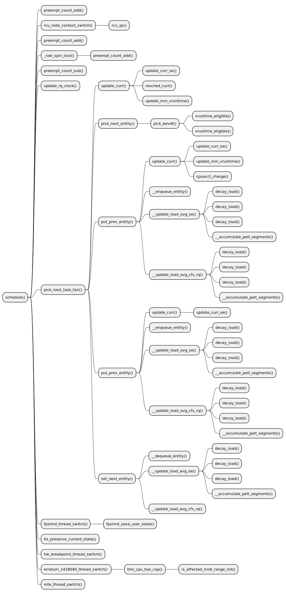

ftrace-chart
==========================
Generate plantuml chart for function-graph trace

## Usage

```
$ ./ftrace-chart.sh -h

ftrace-chart
==========================
Generate plantuml chart for function-graph trace

Format:
  ./ftrace-chart.sh [record|report] [options]

Options
  -h, --help                  Help
  -m, --mode=[trace|stack|flame]
                              "trace" is function-graph chart (excution flow of the function)
                              "stack" is stacktrace chart (where has the function been called)
                              "flame" is flamegraph chart (where and times the function has been called)"
  -f, --function              Function to track
  -t, --timeout               Seconds to trace, you can stop mannully without passing this param.
  -o, --output                Output trace file (default: result/*.data).

Trace Mode Example
---------------------
  Generate chart of schedule() excution flow:

  1. Record function-graph trace of schedule()
  $ ./ftrace-chart.sh record --mode=trace --function=schedule --timeout=10

  2. Generate plantuml files
  $ ./ftrace-chart.sh report --mode=trace

  3. Generate svg image
  $ java -jar thirdparty/plantuml/plantuml-mit.jar -tsvg ./ftrace-chart.data/schedule*.puml

Stack Mode Example
---------------------
  Generate chart of schedule() called positions:

  1. Record stacktrace of schedule()
  $ ./ftrace-chart.sh record --mode=stack --function=schedule --timeout=10

  2. Generate plantuml files and svg image"
  $ ./ftrace-chart.sh report --mode=stack

Flame Mode Example
---------------------
  Generate flame chart of schedule() function:

  1. Record perf data of schedule()
  $ ./ftrace-chart.sh record --mode=flame --function=schedule --timeout=10

  2. Generate flamechart svg image
  $ ./ftrace-chart.sh report --mode=flame

```

## Screen Shot

### Trace Mode
Chart of schedule() excution flow



### Stack Mode
Chart of schedule() called position


### Flame Mode

Flamegraph of schedule() being called

